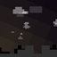
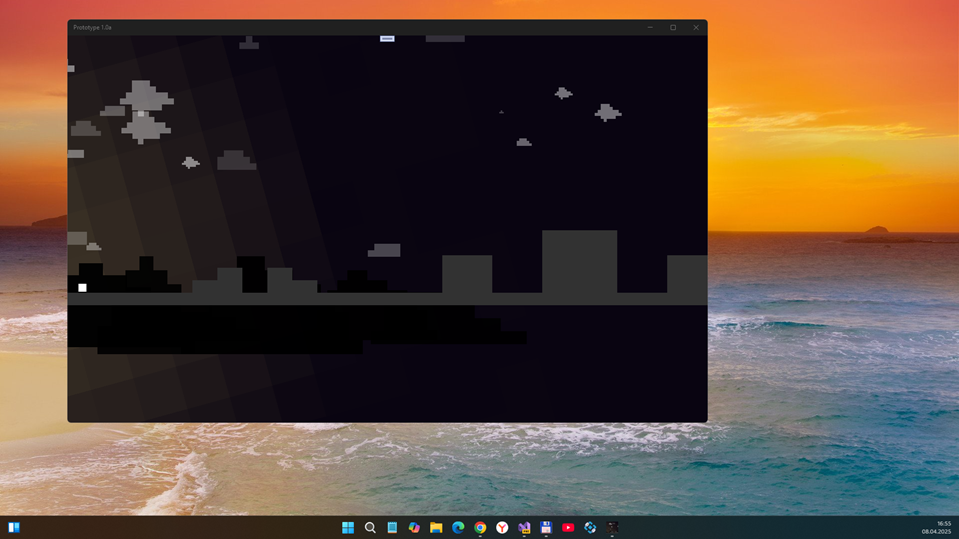
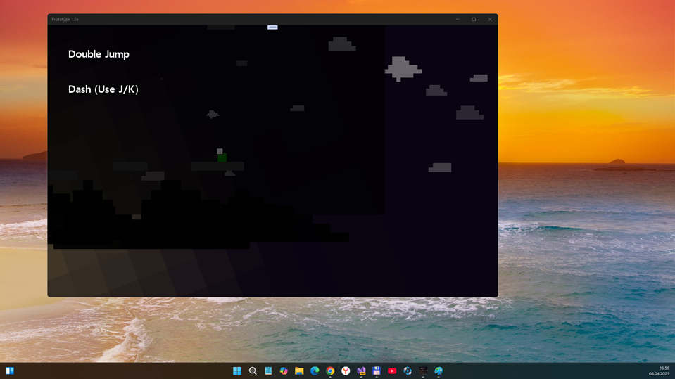
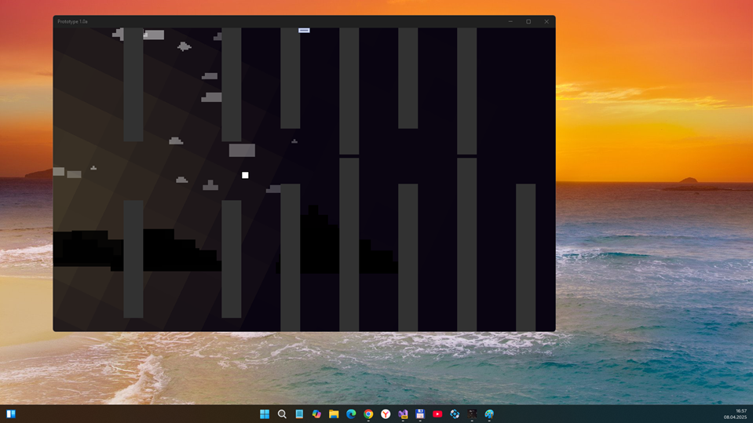

# Prototype 1.0-prealpha - uwp branch 

"UWP-Remake" of ITCH.io Choice-platformer (Prototype codename) "game template" project.

## About
"Choice Platformer
This is a short, unfinished prototype of a platformer made in February 2017 as part of a college admission assignment. It has custom levels based on the powers or game features that the player chooses at select points in the game. It is rather difficult, and not every level has been made. I hope you'll find fun in it, and I may build a more complete game out of this concept in the future."

## Screenshots

## My 2 cents
. NET -> UWP
. Min. Win. SDK = 10240 
. Gode-mod activated :)

## ToDo
- Realize some simplest game process ;)
- Add touchpanel support.

## .
As is. No support. DIY. Learn purposes only.

## Reference(s)
https://stellalumi.itch.io/choice-platformer Original project

## ..
[m][e] April 2025
