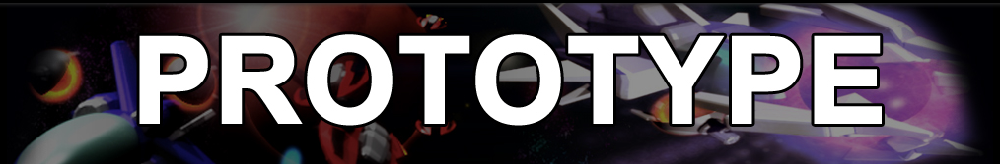

# Prototype

The source code of "Prototype" by X-Out: #1 Place in "Horizontal Shooter with BOSS Competition".

## Progress
- Draft. Work-in-slow-progress

## Resources for R.E./GameDev
- Developer's webpage (stored on web.archive.org):
https://web.archive.org/web/20150214012532/http://xout.blackened-interactive.com/ProtoType/Prototype.html

- Download whole game here: https://web.archive.org/web/20150214012532/http://xout.blackened-interactive.com/ProtoType/ProtoType.zip

## One thing about Fabien's port
The source code rotted a while ago: 
 - It was using SDL 1.3 pBuffer (a fork that ended up canned).
 - It was using a very old version of FMOD.

He emulated FMOD with SDL_Mixer and pBuffer with OpenGL FBO. 

## Credits
[Fabien Sanglard](https://fabiensanglard.net)

## ..
As-is. No support. RnD only / DIY

## .
[m][e] 2023

